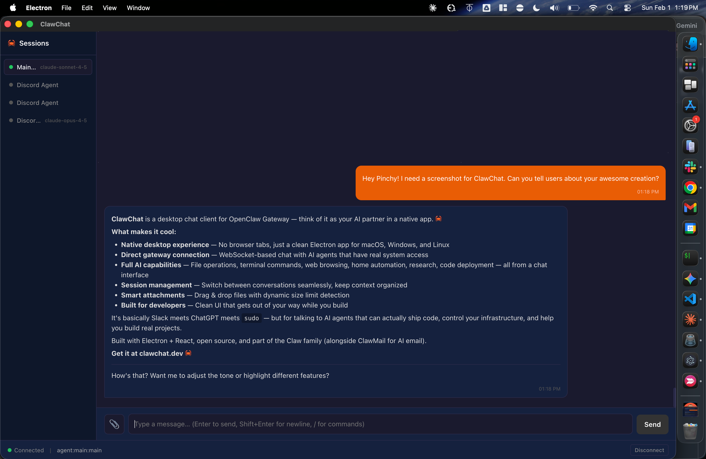

<p align="center">
  
</p>

<h1 align="center">💬 ClawChat</h1>

<p align="center"><strong>Simple desktop client for remote OpenClaw gateways.</strong><br>No Node.js, no npm, no complexity — just download and connect.</p>

---




## Why ClawChat?

ClawChat fills a specific gap in the OpenClaw ecosystem: **simple desktop access to remote gateways**.

### When to use ClawChat:

- ✅ Your gateway runs on a **server** (Linux/remote Mac) and you want to connect from your laptop
- ✅ You're on **Windows or Linux** (no official OpenClaw desktop app for these platforms)
- ✅ You want a **lightweight client** without installing Node.js, npm, or managing the gateway locally
- ✅ You prefer **SSH/Tailscale** setups with a remote gateway

### When to use the official OpenClaw macOS app:

- ✅ You want to **run the gateway locally** on your Mac
- ✅ You need **native macOS integrations** (TCC permissions, system notifications, etc.)
- ✅ You want the app to **manage the gateway lifecycle** for you

**Both are great!** Pick the client that matches your setup. [Learn more about OpenClaw](https://github.com/openclaw/openclaw).

> **🎯 Quick Guide:**
> - Run gateway locally on Mac? → [OpenClaw macOS App](https://github.com/openclaw/openclaw)
> - Run gateway on a server (Linux/remote Mac)? → **ClawChat**
> - Using Windows or Linux? → **ClawChat** (only cross-platform option)

---

## Download

Pre-built releases for macOS, Windows, and Linux are available on the [Releases](https://github.com/ngmaloney/clawchat/releases) page.

- **macOS** — `.dmg` installer
- **Windows** — `.exe` installer
- **Linux** — `.AppImage` (portable)

Or build from source (see [Quick Start](#quick-start) below).

## Perfect for Remote Gateways

ClawChat excels at connecting to **OpenClaw gateways running elsewhere** — whether that's a dedicated server, a home lab, or a cloud instance. 

**Common setup:**
1. Run OpenClaw gateway on a Linux server or remote Mac (via SSH/Tailscale)
2. Install ClawChat on your laptop (Mac, Windows, or Linux)
3. Connect via WebSocket — no Node.js installation required on your laptop

Your conversations and credentials stay on your infrastructure. ClawChat is just a lightweight UI that talks to your gateway.

## Features

- **Full chat UI** — Send messages, receive streamed responses with live text updates
- **Markdown rendering** — Code blocks with syntax highlighting, bold, italic, links, lists
- **Image attachments** — Upload and view images inline
- **Session management** — Switch between multiple chat sessions
- **Slash commands** — Type `/` to access commands like `/new`, `/model`, `/thinking`, `/status`, etc.
- **Auto-reconnect** — Resilient WebSocket connection with exponential backoff
- **Persistent credentials** — Saved locally for auto-connect on launch
- **Cross-platform** — macOS, Windows, and Linux support
- **DevTools access** — F12 or Ctrl+Shift+I for debugging

### 🚧 Coming Soon: Node Mode

Node mode (camera, screen recording, system commands) is currently in development. This will allow ClawChat to act as an OpenClaw node, enabling the gateway to access your local machine's capabilities — making ClawChat the **only cross-platform node solution** for Windows and Linux users.

See the [`feature/node-mode-poc`](https://github.com/ngmaloney/clawchat/tree/feature/node-mode-poc) branch for early testing.

## Quick Start

### Prerequisites

- [Node.js](https://nodejs.org/) 18+
- A running [OpenClaw Gateway](https://docs.openclaw.ai)

### Install

```bash
git clone git@github.com:ngmaloney/clawchat.git
cd clawchat
npm install
```

### Development

```bash
npm run dev
```

### Production Build

```bash
npm run build
```

Outputs packaged binaries to `release/` directory.

## Connecting

### Local Gateway

1. Launch ClawChat
2. Enter your gateway URL (e.g., `ws://localhost:18789`)
3. Enter your gateway auth token
4. Click **Connect**

Your credentials are saved locally and the app will auto-connect on subsequent launches.

## Using Slash Commands

ClawChat supports OpenClaw slash commands for controlling your agent and session. Type `/` in the message input to see available commands:

- `/new` — Start a new session
- `/model` — Show or switch models
- `/thinking` — Toggle extended thinking mode
- `/status` — Show session status and token usage
- `/stop` — Abort current generation
- `/compact` — Summarize and compress session history
- `/verbose` — Toggle verbose output
- `/reset` — Reset the current session

Commands autocomplete as you type. Just start typing `/` and select from the menu.

### Remote Gateway via SSH Tunnel

If your OpenClaw gateway runs on a different machine (e.g., a dedicated server), use SSH port forwarding to securely tunnel the connection:

```bash
ssh -N -L 18789:127.0.0.1:18789 your-gateway-host
```

Example:
```bash
ssh -N -L 18789:127.0.0.1:18789 ts140
```

Then connect ClawChat to `ws://localhost:18789` as if the gateway were local. The SSH tunnel encrypts all traffic between your desktop and the gateway server.

> **Note:** For local WebSocket connections without device identity, ensure your gateway config has `gateway.controlUi.allowInsecureAuth: true` set.

## Tech Stack

- **Electron** — Cross-platform desktop runtime
- **React 18** — UI framework with hooks
- **TypeScript** — Type safety
- **Vite** — Fast build tooling with HMR
- **react-markdown** + **remark-gfm** — Markdown rendering
- **react-syntax-highlighter** — Code syntax highlighting
- **electron-store** — Local credential storage

## Architecture

ClawChat implements the OpenClaw Gateway Protocol v3, including proper handshake, request/response correlation, and event streaming.

```
electron/          # Main process (Node.js)
  main.ts          # App lifecycle, IPC handlers
  preload.ts       # Secure context bridge

src/               # Renderer process (React)
  lib/
    gateway-client.ts    # WebSocket protocol implementation
  hooks/
    useGateway.ts        # Connection state management
    useChat.ts           # Message & session state
  components/
    Dashboard.tsx        # Main UI layout
    ChatView.tsx         # Message list
    MessageInput.tsx     # Input with file upload
    ...
```

## License

Private — not yet published.

---

**Website:** [clawchat.dev](https://clawchat.dev)
